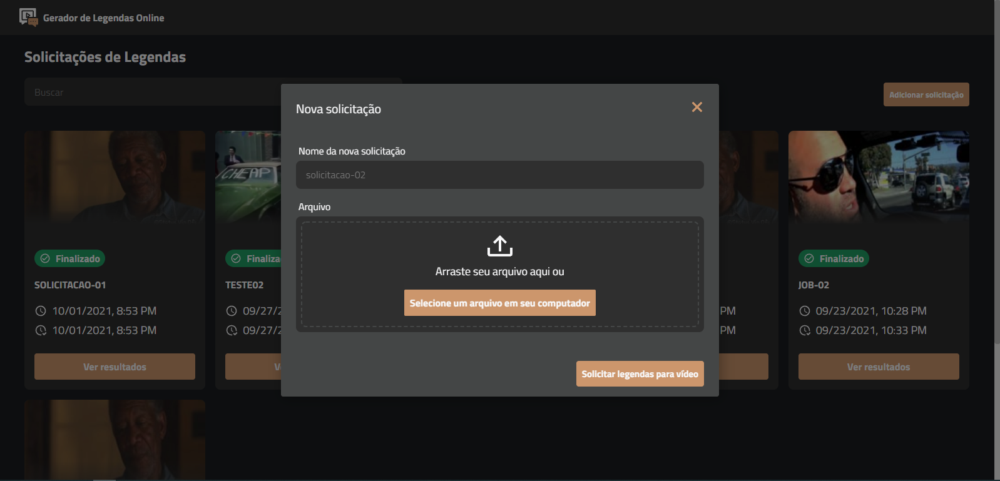
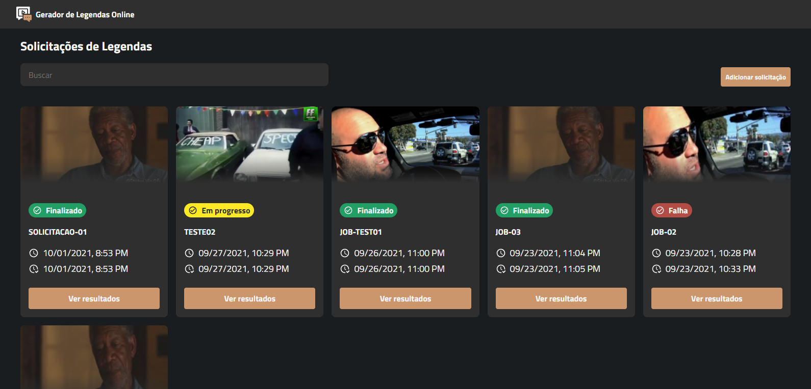
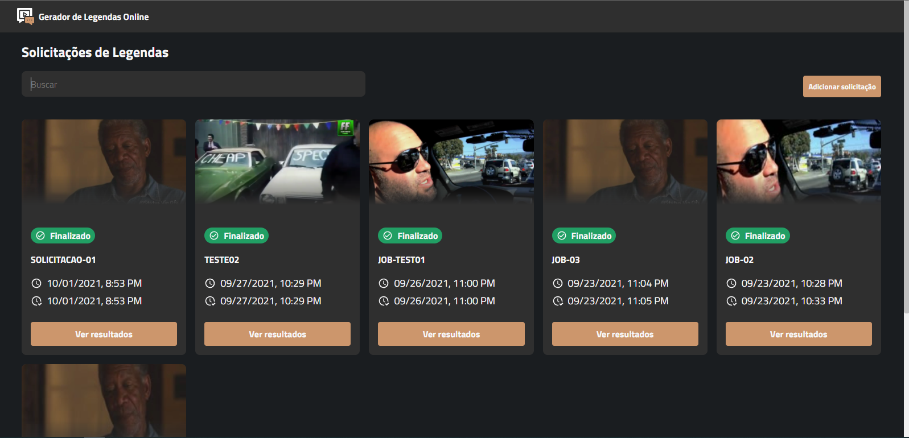
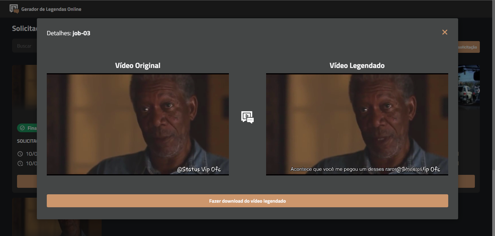

  

# Video Captions - ViCap

Final paper for the Information Systems Course - UNIPAM. This project was developed with the purpose of helping hearing impaired people. Through this application it is possible, after uploading a video, to generate a subtitle request and, as soon as the request is finalized, to get subtitles for the video, as well as to generate a subtitled video and download it. The application allows the generation of subtitles for any language.

### Used Technologies

 
  <code></code>
  <code></code>
  <code></code>
  <code></code>

### Screenshots

### License
[MIT](https://github.com/ederwms/front-vicap/blob/main/LICENSE)

Developed by [Éder Sousa](https://github.com/ederwms)
