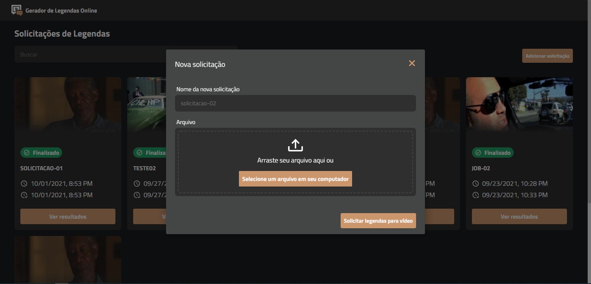

  

# Video Captions - ViCap

Trabalho de conclusão de Curso Sistemas de Informação - UNIPAM. Este projeto foi desenvolvido com a finalidade de auxiliar pessoas com deficiência auditiva. Através da aplicação é possivel, a partir do upload de um vídeo, gerar uma solicitação de legenda e, assim que a solicitação for finalizada, obter legendas para o mesmo bem como gerar um vídeo legendado e fazer o download do mesmo. A aplicação permite geração de legendas para qualquer idioma.

### Screenshots

### Licença
[MIT](https://github.com/ederwms/front-vicap/blob/main/LICENSE)

Desenvolvido por [Éder Sousa](https://github.com/ederwms)
